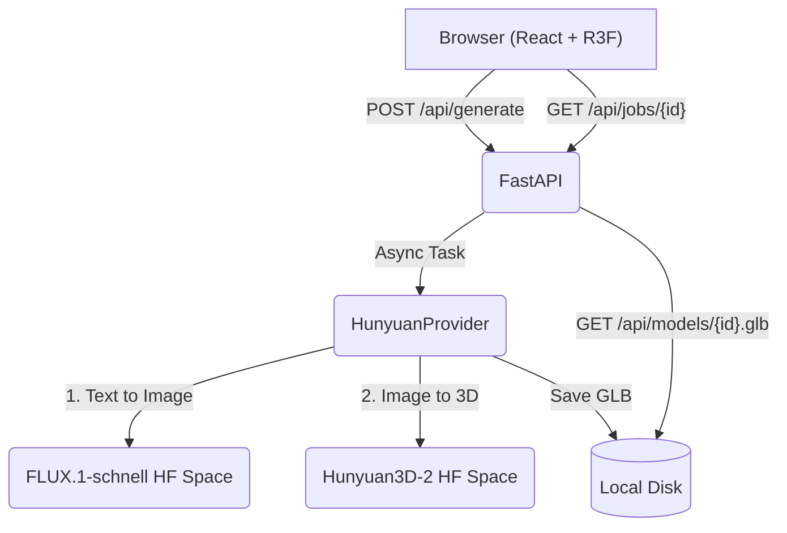

# OneImmersive Text-to-3D

A modern, full-stack application that generates 3D models (GLB) from text prompts. Built as a technical assignment for OneImmersive.

## Architecture



### AI Pipeline

The application uses a two-step AI pipeline to generate 3D models:
1. **FLUX.1-schnell**: Generates a high-quality reference image from the text prompt (fast, typically roughly 10s).
2. **Hunyuan3D-2**: Reconstructs a 3D mesh (GLB) from the reference image (roughly 1-2 minutes).

**Why this approach?**
- Direct text-to-3D models (like Shap-E) produce lower quality results.
- State-of-the-art models like Hunyuan3D-2 have disabled direct text-to-3D in their public demo Spaces, but image-to-3D works well.
- Using `gradio_client`, we can leverage these powerful models running on Hugging Face's GPUs without needing our own expensive GPU infrastructure.

### Abstraction

The backend uses a `Provider` interface. The currently implemented provider is `HunyuanProvider`, but you can easily add new commercial or open-source backends by implementing the `Provider` interface and registering it in `providers/__init__.py`. The active provider is selected via the `PROVIDER` environment variable.

### Asynchronous Job Pattern

Generating 3D models takes 1-2 minutes. If we held the HTTP request open, many serverless or free-tier platforms would timeout. Instead, the backend uses an asynchronous job pattern:
- `POST /api/generate` returns a `job_id` immediately.
- The frontend polls `GET /api/jobs/{job_id}` to check status and update the UI with elapsed time.

## Running Locally

### Prerequisites
- Python 3.11+
- Node.js 20+
- Hugging Face Access Token (Read permission)

### 1. Backend Setup

```bash
cd backend
python -m venv .venv
source .venv/bin/activate
pip install -r requirements.txt

# Configure environment
cp .env.example .env
# Edit .env and add your HF_TOKEN
```

Run the backend server:
```bash
uvicorn main:app --host 0.0.0.0 --port 8000
```

*(Optional)* Pre-generate fallback sample models so the app works even if the AI providers are down:
```bash
python make_samples.py
```

### 2. Frontend Setup

In a new terminal:
```bash
cd frontend
npm install
npm run dev
```

Visit `http://localhost:5173` in your browser.

### Sample Models

The application includes pre-generated sample models (e.g. a ceramic teapot and a wooden chair). These can be loaded instantly from the sidebar, allowing you to demo the 3D viewer without waiting for generation or consuming any GPU quota.

## Deployment

This app is designed to be easily deployed to Render as a Web Service. It bundles the built Vite frontend and serves it via FastAPI in a single container.

### Step-by-step Deploy (Render)

1. Go to [Render](https://render.com/) and create a **New Web Service**.
2. Connect the GitHub repository for this project.
3. For the Runtime, select **Docker**.
4. Choose the **Free** instance type.
5. Under Environment Variables, add a new variable:
   - Key: `HF_TOKEN`
   - Value: Your Hugging Face access token (a Read token is sufficient)
6. Click **Create Web Service**.

*Note: Render's free instances sleep after 15 minutes of inactivity. This means the very first request after a period of inactivity may take about a minute while the container wakes up.*

### Known Limitations & Tradeoffs

- **ZeroGPU Quota:** Generating new models relies on free Hugging Face Spaces which use ZeroGPU and have a strict time quota. If you exceed this quota, generation will fail until it resets. However, the pre-generated sample models will continue to work.
- **White Mesh Only:** The default Hunyuan3D-2 pipeline generates untextured white meshes. Texturing requires a separate pass which adds complexity and time, but is achievable. For this assignment, the white mesh demonstrates the capability cleanly.
- **Cold Starts & Queues:** Render free instances sleep after 15 minutes of inactivity, so the initial page load might take ~1 minute to wake up. Additionally, the backend relies on free HF Spaces for generation, which may also have their own cold starts or queues during peak times.
- **In-Memory State:** The job store (`jobs` dict in `main.py`) is held in memory. This is perfectly fine for a single-container deployment, but would need Redis or a Database if scaled horizontally.

## What I'd improve with more time

- Add a texture-generation pass to colorize the models.
- Implement WebSockets instead of HTTP polling for real-time job updates.
- Store generated models in an S3 bucket instead of the local container filesystem.
- Add user authentication and a persistent database to save generation history across sessions.
